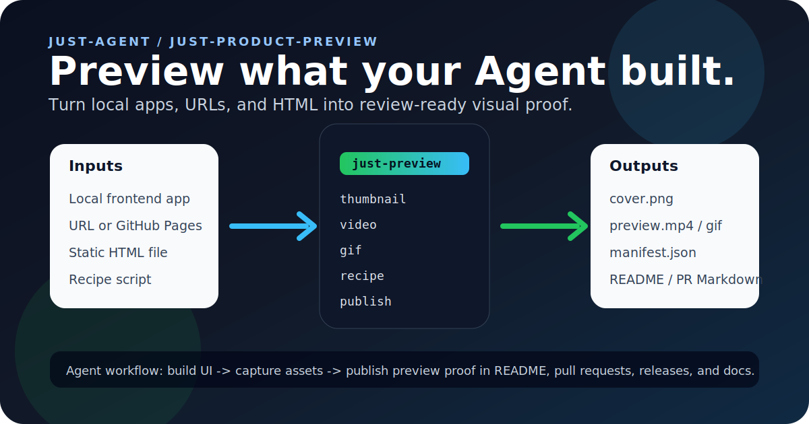
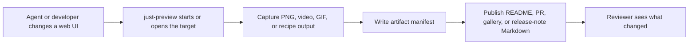

<div align="center">
  <h1>Just-Product-Preview</h1>
  <p><strong>Agent-native preview pipeline for turning local apps, URLs, and HTML into README-ready visual proof.</strong></p>
  <p>Powered by the <code>just-preview</code> CLI, reusable packages, recipes, manifests, and a GitHub Action.</p>
  <p>
    <a href="./README.zh-CN.md">中文</a>
    ·
    <a href="./docs/quick-start.md">Quick Start</a>
    ·
    <a href="./docs/cli.md">CLI</a>
    ·
    <a href="./docs/github-actions.md">GitHub Actions</a>
    ·
    <a href="./examples">Examples</a>
    ·
    <a href="./CHANGELOG.md">Changelog</a>
  </p>
  <p>
    
    
    
    
    
  </p>
</div>

<p align="center">
  
</p>

> Preview what your Agent built.

Just-Product-Preview is the public repository for **Just-Preview**, a monorepo-based toolkit that captures web work as preview assets. It can start a local frontend app, open a URL or HTML file in a real browser, and produce the files reviewers need: cover images, video, GIF, manifests, PR comments, README snippets, galleries, and release-note Markdown.

## What It Generates

| Need | Command surface | Output |
| --- | --- | --- |
| README cover image | `just-preview thumbnail` | PNG or JPEG thumbnail |
| Product walkthrough | `just-preview video` | WebM, MP4, or MOV video |
| Lightweight animated proof | `just-preview gif` | GIF preview with size controls |
| Scripted capture | `just-preview recipe` | Recipe-based Recording with wait, scroll, click, fill, hover, press, and screenshot steps |
| Agent handoff | `--manifest` | JSON artifact manifest for CI and automation |
| Publishing loop | `just-preview publish` | README snippet, GitHub PR Preview comment, gallery, or release-note Markdown |

## Why It Exists

AI agents and developers can build UI faster than teams can review it. Just-Preview closes that gap:

- Capture local apps before they are deployed.
- Attach visual proof to pull requests and releases.
- Keep repeatable recipes for mobile, docs, dashboards, landing pages, and PR previews.
- Give agents machine-readable manifests instead of loose file paths.
- Turn generated artifacts into Markdown surfaces that humans can scan quickly.

## Quick Start

Install and build the monorepo:

```bash
pnpm install
pnpm build
```

Install the browser and video runtime used by Playwright:

```bash
pnpm browsers:install
```

Check the environment:

```bash
pnpm just-preview doctor
```

Create a thumbnail:

```bash
pnpm just-preview thumbnail --url https://example.com --out outputs/cover.png
```

Create a video:

```bash
pnpm just-preview video --url https://example.com --out outputs/preview.mp4 --duration 8
```

Create a GIF:

```bash
pnpm just-preview gif --url http://localhost:3000 --out outputs/preview.gif --duration 6 --gif-width 960
```

## Local App Capture

The main Agent workflow is capturing an app that is not already deployed:

```bash
pnpm just-preview video \
  --serve-command "pnpm dev" \
  --serve-url http://localhost:5173 \
  --out outputs/preview.mp4 \
  --duration 8 \
  --manifest outputs/preview.manifest.json
```

For monorepos, point the server command at a subdirectory:

```bash
pnpm just-preview thumbnail \
  --serve-command "pnpm dev" \
  --serve-cwd apps/web \
  --serve-url http://localhost:3000 \
  --serve-silent \
  --out outputs/cover.png
```

Try the bundled local app example:

```bash
pnpm just-preview video \
  --serve-command "node server.mjs" \
  --serve-cwd examples/local-app \
  --serve-url http://127.0.0.1:4177 \
  --serve-silent \
  --out outputs/local-app-preview.webm \
  --duration 5 \
  --manifest outputs/local-app-preview.manifest.json
```

## Plan, Validate, And Publish

Plan a capture before launching the browser:

```bash
pnpm just-preview plan video --config just-preview.config.example.json --manifest outputs/video-plan.json
```

Validate configuration and recipe files:

```bash
pnpm just-preview validate --config just-preview.config.example.json recipes/landing-page.json
```

Publish generated manifests into review-ready Markdown:

```bash
pnpm just-preview publish --manifest "outputs/*.manifest.json" --format readme --base-url ./outputs --out outputs/readme-preview.md
pnpm just-preview publish --manifest "outputs/*.manifest.json" --format pr-comment --out outputs/pr-comment.md
pnpm just-preview publish --manifest "outputs/*.manifest.json" --format gallery --out outputs/preview-gallery.md
pnpm just-preview publish --manifest "outputs/*.manifest.json" --format release-note --out outputs/release-preview.md
```

Use `--base-url` or `--asset-prefix` when assets are hosted on GitHub Pages, release assets, or an artifact proxy:

```bash
pnpm just-preview publish \
  --manifest "outputs/*.manifest.json" \
  --format pr-comment \
  --base-url https://just-agent.github.io/Just-Product-Preview/previews/pr-123 \
  --out outputs/pr-comment.md
```

## Recipe-based Recording

Recipes make capture repeatable across agents, machines, and CI runs.

```json
{
  "serveCommand": "pnpm dev",
  "serveUrl": "http://localhost:5173",
  "serveSilent": true,
  "output": "outputs/preview.mp4",
  "viewport": "desktop",
  "steps": [
    { "type": "wait", "ms": 800 },
    { "type": "scroll", "to": 600, "duration": 1200 },
    { "type": "click", "selector": "[data-preview='demo-button']" }
  ]
}
```

Supported steps:

| Step | Purpose |
| --- | --- |
| `wait` | Pause for animations, data, or transitions. |
| `scroll` | Record long pages and reveal lower sections. |
| `click` | Trigger UI states. |
| `fill` | Enter form content. |
| `hover` | Show hover states. |
| `press` | Exercise keyboard flows. |
| `screenshot` | Capture still frames during a recipe. |

## Monorepo Architecture

This repository uses a monorepo architecture.

That keeps the CLI, reusable packages, docs, recipes, examples, GitHub Action, release checks, and validation logs versioned together.

```txt
Just-Product-Preview/
  apps/
    cli/                  # just-preview command
    docs/                 # documentation builder
  packages/
    core/                 # shared browser, config, device, server, manifest utilities
    html2thumbnail/       # HTML to Thumbnail
    html2video/           # HTML to Video, MP4, WebM, MOV, GIF
    preview-recipe/       # Recipe-based Recording
    preview-publisher/    # README, PR, gallery, and release-note Markdown
  docs/                   # user documentation
  examples/               # basic URL, local HTML, local app, publish workflow, action examples
  recipes/                # reusable capture recipes
  schema/                 # JSON schema for config
  scripts/                # release, validation, and smoke checks
  action.yml              # reusable composite GitHub Action
```

## Package Map

| Package | Purpose |
| --- | --- |
| `@just-agent/preview-core` | Shared browser automation, devices, local server lifecycle, config, output paths, manifests, diagnostics, and filesystem utilities. |
| `@just-agent/html2thumbnail` | Convert HTML, URLs, and local frontend output into PNG or JPEG thumbnails. |
| `@just-agent/html2video` | Convert HTML, URLs, and local frontend output into WebM, MP4, MOV, or GIF previews. |
| `@just-agent/preview-recipe` | Run scripted recordings with reproducible interaction steps. |
| `@just-agent/preview-publisher` | Convert artifact manifests into README snippets, PR comments, galleries, and release-note Markdown. |
| `@just-agent/preview-cli` | Command line interface exposed as `just-preview`. |

## GitHub Action

This repository includes a reusable composite action.

```yaml
name: Generate Preview

on:
  pull_request:
  workflow_dispatch:

jobs:
  preview:
    runs-on: ubuntu-latest
    steps:
      - uses: actions/checkout@v4
      - uses: Just-Agent/Just-Product-Preview@v0.4.1
        with:
          command: video
          url: https://example.com
          out: outputs/preview.mp4
      - uses: actions/upload-artifact@v4
        with:
          name: just-preview-assets
          path: outputs/*
```

See [docs/github-actions.md](./docs/github-actions.md) for local app serving, PR preview assets, and publish-ready Markdown.

## Agent Workflow



## Release Readiness

The current version is `0.4.1`.

v0.4.1 focuses on release hardening:

- Locked dependency graph with `pnpm-lock.yaml`.
- Package versions are pinned instead of using `latest`.
- Test scripts fail when compiled Node tests fail.
- Composite action chooses command-aware default outputs.
- Publishable packages include license, repository, homepage, bugs, keywords, and public publish metadata.
- Smoke scripts cover publish Markdown, action inputs, local HTML capture, thumbnail, video, GIF, and manifest output.
- Chromium can be overridden with `--chromium-executable` or `JUST_PREVIEW_CHROMIUM_EXECUTABLE`.

Release references:

- [CHANGELOG.md](./CHANGELOG.md)
- [RELEASE_NOTES.md](./RELEASE_NOTES.md)
- [RELEASE_CHECKLIST.md](./RELEASE_CHECKLIST.md)
- [RELEASE_MANIFEST.md](./RELEASE_MANIFEST.md)
- [LOGS.md](./LOGS.md)

## Validation

```bash
pnpm validate:json
pnpm release:check
pnpm release:checklist
pnpm build
pnpm typecheck
pnpm lint
pnpm test
pnpm smoke:publish
pnpm smoke:action-inputs
pnpm smoke:local-html
```

CI runs the same release checks plus Playwright browser installation and preview smoke flows.

## Requirements

| Requirement | Notes |
| --- | --- |
| Node.js | 18 or newer. CI uses Node 22. |
| pnpm | `10.33.4` is pinned in `packageManager`. |
| Playwright Chromium | Required for browser capture. |
| Playwright FFmpeg | Required for MP4, MOV, and GIF conversion. |

## Roadmap

| Version | Focus | Status |
| --- | --- | --- |
| `v0.1.0` | Monorepo MVP with core, thumbnail, video, recipe, and CLI. | Done |
| `v0.2.0` | GIF, config, init, doctor, devices, docs, schema, and logs. | Done |
| `v0.3.0` | Local app serving, preflight plan, validation, and manifests. | Done |
| `v0.4.0` | Manifest-to-Markdown publishing and reusable GitHub Action. | Done |
| `v0.4.1` | Release hardening, smoke checks, package metadata, pinned deps. | Done |
| `v0.5.0` | Agent integration guides for Claude Code, Codex, Cursor, and Just-Agent. | Planned |
| `v0.6.0` | Preview Studio UI with device selector, history, and export controls. | Planned |

## License

MIT. See [LICENSE](./LICENSE).
