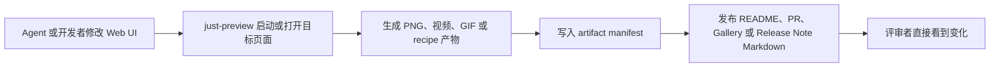

<div align="center">
  <h1>Just-Product-Preview</h1>
  <p><strong>把本地 App、URL 和 HTML 转成 README、PR、Release 可用的可视化证明。</strong></p>
  <p>由 <code>just-preview</code> CLI、monorepo packages、recipes、manifests 和 GitHub Action 组成。</p>
  <p>
    <a href="./README.md">English</a>
    ·
    <a href="./docs/quick-start.md">快速开始</a>
    ·
    <a href="./docs/cli.md">CLI</a>
    ·
    <a href="./docs/github-actions.md">GitHub Actions</a>
    ·
    <a href="./examples">示例</a>
    ·
    <a href="./CHANGELOG.md">更新日志</a>
  </p>
  <p>
    
    
    
    
    
  </p>
</div>

<p align="center">
  
</p>

> Preview what your Agent built.

Just-Product-Preview 是 **Just-Preview** 的公开仓库。它面向 Agent、前端项目、开源 README、GitHub PR Preview 和 Release 流程，负责把网页/App 的真实效果变成可复用的预览素材。

Just-Preview 使用 monorepo 单仓多包架构。

## 它能生成什么

| 场景 | 命令 | 输出 |
| --- | --- | --- |
| README 封面图 | `just-preview thumbnail` | PNG / JPEG 缩略图 |
| 产品演示视频 | `just-preview video` | WebM / MP4 / MOV |
| 轻量动图 | `just-preview gif` | GIF 预览图 |
| 脚本化录制 | `just-preview recipe` | wait / scroll / click / fill / hover / press / screenshot |
| Agent 交接 | `--manifest` | 结构化 artifact manifest |
| 发布 Markdown | `just-preview publish` | README 片段、PR 评论、Gallery、Release Note |

## 为什么需要它

Agent 和开发者可以很快生成网页，但评审者需要看到真实效果。Just-Preview 的目标是让生成出来的 Web 工作可见、可复查、可分享：

- 本地 App 尚未部署时，也能生成封面图、视频和 GIF。
- PR、Release、README 中可以附带可视化证据，而不是只写描述。
- Recipe 让移动端、文档站、Dashboard、Landing Page、PR Preview 可以重复录制。
- Manifest 让 Agent 和 CI 读到结构化结果，不再靠猜文件路径。
- Publish 层把产物转成可直接粘贴的 Markdown。

## 快速开始

安装依赖并构建：

```bash
pnpm install
pnpm build
```

安装 Playwright 浏览器与 FFmpeg：

```bash
pnpm exec playwright install chromium ffmpeg
```

检查环境：

```bash
pnpm just-preview doctor
```

生成缩略图：

```bash
pnpm just-preview thumbnail --url https://example.com --out outputs/cover.png
```

生成视频：

```bash
pnpm just-preview video --url https://example.com --out outputs/preview.mp4 --duration 8
```

生成 GIF：

```bash
pnpm just-preview gif --url http://localhost:3000 --out outputs/preview.gif --duration 6 --gif-width 960
```

## 录制本地 App

这是最适合 Agent 的工作流：先启动本地前端，再等待 URL 可访问，然后录制并输出 manifest。

```bash
pnpm just-preview video \
  --serve-command "pnpm dev" \
  --serve-url http://localhost:5173 \
  --out outputs/preview.mp4 \
  --duration 8 \
  --manifest outputs/preview.manifest.json
```

如果前端在 monorepo 子目录中：

```bash
pnpm just-preview thumbnail \
  --serve-command "pnpm dev" \
  --serve-cwd apps/web \
  --serve-url http://localhost:3000 \
  --serve-silent \
  --out outputs/cover.png
```

运行仓库内置示例：

```bash
pnpm just-preview video \
  --serve-command "node server.mjs" \
  --serve-cwd examples/local-app \
  --serve-url http://127.0.0.1:4177 \
  --serve-silent \
  --out outputs/local-app-preview.webm \
  --duration 5 \
  --manifest outputs/local-app-preview.manifest.json
```

## 预检、校验与发布

先生成 capture plan，不启动浏览器：

```bash
pnpm just-preview plan video --config just-preview.config.example.json --manifest outputs/video-plan.json
```

校验配置和 recipe：

```bash
pnpm just-preview validate --config just-preview.config.example.json recipes/landing-page.json
```

把 manifest 转成可发布 Markdown：

```bash
pnpm just-preview publish --manifest "outputs/*.manifest.json" --format readme --base-url ./outputs --out outputs/readme-preview.md
pnpm just-preview publish --manifest "outputs/*.manifest.json" --format pr-comment --out outputs/pr-comment.md
pnpm just-preview publish --manifest "outputs/*.manifest.json" --format gallery --out outputs/preview-gallery.md
pnpm just-preview publish --manifest "outputs/*.manifest.json" --format release-note --out outputs/release-preview.md
```

如果产物会放在 GitHub Pages、Release asset 或 artifact proxy 上，可以设置 `--base-url` 或 `--asset-prefix`：

```bash
pnpm just-preview publish \
  --manifest "outputs/*.manifest.json" \
  --format pr-comment \
  --base-url https://just-agent.github.io/Just-Product-Preview/previews/pr-123 \
  --out outputs/pr-comment.md
```

## Recipe 录制

Recipe 用来把录制步骤固化下来，便于 Agent、CI 和团队成员复现。

```json
{
  "serveCommand": "pnpm dev",
  "serveUrl": "http://localhost:5173",
  "serveSilent": true,
  "output": "outputs/preview.mp4",
  "viewport": "desktop",
  "steps": [
    { "type": "wait", "ms": 800 },
    { "type": "scroll", "to": 600, "duration": 1200 },
    { "type": "click", "selector": "[data-preview='demo-button']" }
  ]
}
```

## Monorepo 架构

Just-Product-Preview 把 CLI、可复用包、文档、示例、recipes、GitHub Action、release checks 和日志放在一个仓库中统一维护。

```txt
Just-Product-Preview/
  apps/
    cli/                  # just-preview 命令
    docs/                 # 文档构建器
  packages/
    core/                 # 浏览器、设备、本地服务、配置、manifest 等基础能力
    html2thumbnail/       # HTML to Thumbnail
    html2video/           # HTML to Video / GIF / MP4 / WebM / MOV
    preview-recipe/       # Recipe-based Recording
    preview-publisher/    # README / PR / Gallery / Release Note Markdown
  docs/
  examples/
  recipes/
  schema/
  scripts/
  action.yml
```

## 包结构

| Package | 用途 |
| --- | --- |
| `@just-agent/preview-core` | 浏览器自动化、设备预设、本地服务生命周期、配置、输出路径、manifest、diagnostics 和文件工具。 |
| `@just-agent/html2thumbnail` | 把 HTML、URL、本地前端输出转成 PNG / JPEG 缩略图。 |
| `@just-agent/html2video` | 把 HTML、URL、本地前端输出转成 WebM、MP4、MOV 或 GIF。 |
| `@just-agent/preview-recipe` | 运行可复现的脚本化录制步骤。 |
| `@just-agent/preview-publisher` | 把 artifact manifests 转成 README、PR 评论、Gallery 和 Release Note。 |
| `@just-agent/preview-cli` | CLI 入口，命令名为 `just-preview`。 |

## GitHub Action

仓库内置可复用 composite action：

```yaml
name: Generate Preview

on:
  pull_request:
  workflow_dispatch:

jobs:
  preview:
    runs-on: ubuntu-latest
    steps:
      - uses: actions/checkout@v4
      - uses: Just-Agent/Just-Product-Preview@v0.4.1
        with:
          command: video
          url: https://example.com
          out: outputs/preview.mp4
      - uses: actions/upload-artifact@v4
        with:
          name: just-preview-assets
          path: outputs/*
```

更多用法见 [docs/github-actions.md](./docs/github-actions.md)。

## Agent 工作流



## v0.4.1 发布硬化

当前版本为 `0.4.1`。

v0.4.1 不继续盲目堆功能，而是让项目更接近可发布、可部署、可稳定运行：

- 使用 `pnpm-lock.yaml` 锁定依赖。
- 包版本固定，不使用 `latest`。
- 测试脚本不再使用 `|| true` 假通过。
- GitHub Action 根据命令自动选择默认输出。
- npm 包补齐 license、repository、homepage、bugs、keywords 和 public publish metadata。
- smoke 脚本覆盖 publish Markdown、Action 输入、本地 HTML capture、thumbnail、video、GIF 和 manifest。
- 支持 `--chromium-executable` 或 `JUST_PREVIEW_CHROMIUM_EXECUTABLE` 指定 Chromium。

发布参考：

- [CHANGELOG.md](./CHANGELOG.md)
- [RELEASE_NOTES.md](./RELEASE_NOTES.md)
- [RELEASE_CHECKLIST.md](./RELEASE_CHECKLIST.md)
- [RELEASE_MANIFEST.md](./RELEASE_MANIFEST.md)
- [LOGS.md](./LOGS.md)

## 验证命令

```bash
pnpm validate:json
pnpm release:check
pnpm release:checklist
pnpm build
pnpm typecheck
pnpm lint
pnpm test
pnpm smoke:publish
pnpm smoke:action-inputs
pnpm smoke:local-html
```

## 环境要求

| 依赖 | 说明 |
| --- | --- |
| Node.js | 18 或更高版本，CI 使用 Node 22。 |
| pnpm | `10.33.4` 已在 `packageManager` 中固定。 |
| Playwright Chromium | 浏览器截图和录制需要。 |
| Playwright FFmpeg | MP4、MOV 和 GIF 转换需要。 |

## 路线图

| 版本 | 重点 | 状态 |
| --- | --- | --- |
| `v0.1.0` | Monorepo MVP、core、thumbnail、video、recipe、CLI。 | 已完成 |
| `v0.2.0` | GIF、config、init、doctor、devices、docs、schema、logs。 | 已完成 |
| `v0.3.0` | 本地 App serving、plan、validate、manifest。 | 已完成 |
| `v0.4.0` | manifest-to-Markdown publishing 和 reusable GitHub Action。 | 已完成 |
| `v0.4.1` | release hardening、smoke checks、包元数据、依赖锁定。 | 已完成 |
| `v0.5.0` | Claude Code、Codex、Cursor、Just-Agent 的 Agent 集成指南。 | 计划中 |
| `v0.6.0` | Preview Studio UI、设备选择、历史记录和导出控制。 | 计划中 |

## License

MIT. See [LICENSE](./LICENSE).
